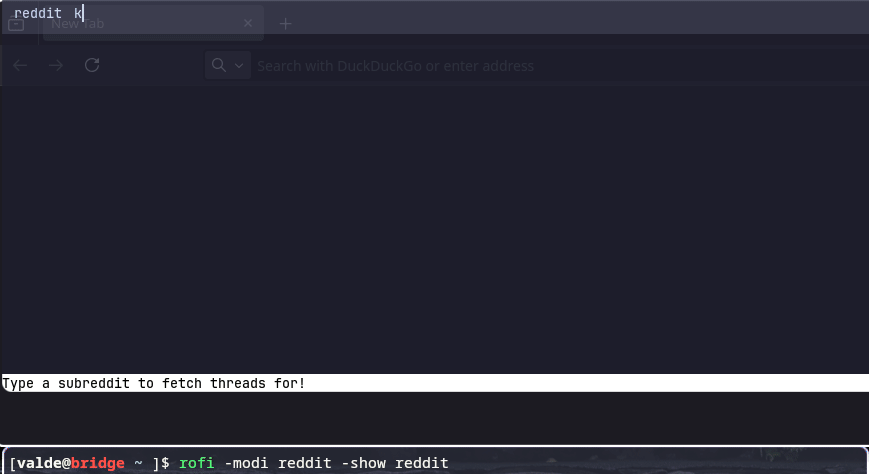
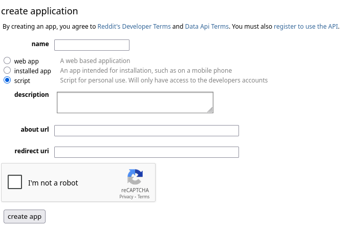
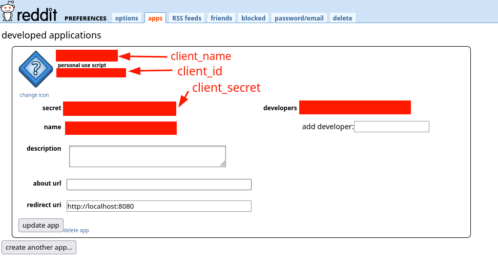

# rofi-reddit 

**Browse reddit threads from rofi!**

This is a [rofi](github.com/DaveDavenport/rofi) plugin that allows you to browse Reddit threads from rofi. It uses the [Reddit API](https://www.reddit.com/dev/api/) to fetch the threads and display them in a rofi menu.



Run rofi like:

```bash
rofi -show rofi-reddit -modi rofi-reddit
```

## Installation 

### From source

You need a C compilation toolchain (a C compiler like `clang` or `gcc`, `meson` and `pkg-config`), `libcurl` and `rofi`. The rest of the dependencies will be resolved by meson.

You will also need development headers for rofi. Depending on your distribution these may be included in different packages:

- Arch Linux, Gentoo: included with `rofi` and `meson`
- OpenSUSE: `zypper in rofi rofi-devel meson`
- Debian: `apt install rofi-dev meson`
- Ubuntu: `apt install rofi-dev meson`
- Solus: `eopkg it rofi-devel`
- CentOS: Install `meson` (find `rofi-devel` headers yourself)
- Fedora: `dnf install meson libtool cairo-devel rofi-devel`
- VoidLinux: `xbps-install -S rofi-devel meson libtool`
- Others: look it up :)


`rofi-reddit` uses meson as a build system:

```shell
git clone https://github.com/intael/rofi-reddit.git
cd rofi-reddit/
meson setup build
meson compile -C build/
meson install -C build
```

## Configuration

You will need to create a Reddit application bound to your Reddit account to allow this plugin to browse Reddit on your behalf. As of now, the plugin only supports fetching the "hot" threads from a given subreddit.

To create a Reddit application, follow these steps:
1. Go to your Reddit account preferences: https://www.reddit.com/prefs/apps
2. Scroll down to the "Developed Applications" section.
3. Click on "Create App"
4. Fill in the required fields making sure to select "script" as the application type:

5. Go to `~/.config/rofi-reddit/config.toml` and fill in the `client_id`, `client_secret` and `client_name` fields. You can find all of these in the application you just created by going to https://www.reddit.com/prefs/apps and clicking "edit" on your application. These are the values for each field:




### Troubleshooting your Reddit App

You can verify that your reddit app works fine by trying to get an access token and then using it.
```shell
curl --request POST \
  --url https://www.reddit.com/api/v1/access_token \
  -A '<client-name>' \
  -u '<client-id>:<client-secret>' \
  --header 'content-type: application/x-www-form-urlencoded' \
  --data scope=read \
  --data grant_type=client_credentials
```

Request with auth bearer
```shell
curl --request GET \
  --url https://oauth.reddit.com/r/libertarian/hot \
  --header 'Authorization: Bearer <access-token>'
```

## Development

Run the tests (requires ruby 2.7!):
```shell
meson setup build && meson test -C build
```


